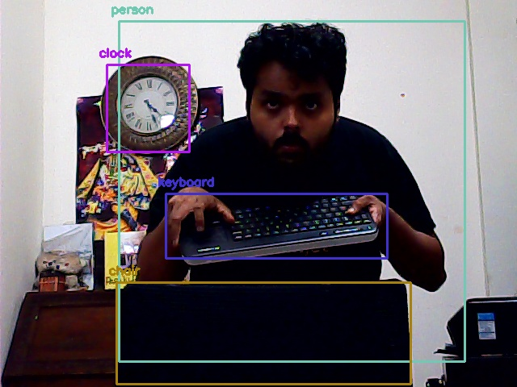

# Object detection using deep learning with OpenCV and Python 

## Dependencies
  * opencv
  * numpy
  
`pip install numpy opencv-python`

Provided all the files are in the current directory and web cam is important, below command will apply object detection on the video.
 
 `$ python yolo_opencv.py --image dog.jpg --config yolov3.cfg --weights yolov3.weights --classes yolov3.txt`
 
 
 ### sample output :
 
  
 (_SSD and Faster R-CNN examples will be added soon_)
